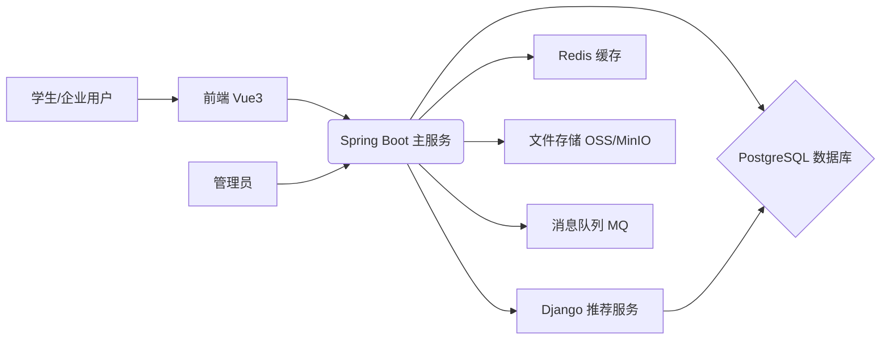

# 校园招聘系统后端项目开发大纲

## 1. 项目概述

- **核心目标**: 为校园招聘系统前端 (Vue3) 提供稳定、高效、安全的 RESTful API 服务、数据存储和智能推荐功能。
- **技术选型**:
    - **主要API与业务逻辑**: Spring Boot (Java)
    - **智能推荐服务 (协同过滤)**: Django (Python)
    - **数据库**: PostgreSQL
    - **缓存**: Redis (可选，用于缓存热点数据、Session管理等)
    - **消息队列**: RabbitMQ / Kafka (可选，用于服务间解耦，如通知发送、日志处理)
    - **容器化**: Docker
- **架构原则**:
    - **主服务 (Spring Boot)**: 采用分层架构 (Controller - Service - Repository)。
    - **推荐服务 (Django)**: 独立服务，通过内部API与主服务交互。
    - 模块化设计，按业务领域划分代码包 (package)。
    - 遵循 RESTful API 设计规范。
    - 注重代码质量、可测试性、可扩展性和安全性。

## 2. 架构设计



- **Spring Boot 主服务**: 处理核心业务逻辑，包括用户认证、授权、用户信息管理、职位管理、申请管理、简历管理（元数据）、基础通知、与数据库和缓存交互、调用推荐服务API、文件上传处理等。
- **Django 推荐服务**: 专注于实现协同过滤推荐算法。从数据库读取所需数据（用户行为、职位信息等），计算推荐结果，并提供API供主服务调用。
- **PostgreSQL**: 持久化存储所有核心业务数据。
- **文件存储**: (建议使用对象存储如阿里云OSS、腾讯云COS或自建MinIO) 存储用户头像、企业Logo、简历文件等。

## 3. 目录结构建议

### 3.1 Spring Boot 主服务

```
recruitment-system-springboot/
├── src/
│   ├── main/
│   │   ├── java/
│   │   │   └── com/example/recruitmentsystem/
│   │   │       ├── config/           # 配置类 (Security, Jackson, Cache, MQ等)
│   │   │       ├── controller/       # Controller层 (按模块划分)
│   │   │       │   ├── AuthController.java
│   │   │       │   ├── UserController.java
│   │   │       │   ├── JobController.java
│   │   │       │   ├── ApplicationController.java
│   │   │       │   ├── ResumeController.java
│   │   │       │   ├── NotificationController.java
│   │   │       │   └── AdminController.java
│   │   │       ├── service/          # Service层 (业务逻辑)
│   │   │       │   ├── impl/         # Service实现类
│   │   │       │   ├── AuthService.java
│   │   │       │   └── ...
│   │   │       ├── repository/       # Repository层 (JPA接口)
│   │   │       │   ├── UserRepository.java
│   │   │       │   └── ...
│   │   │       ├── entity/           # JPA实体类
│   │   │       │   ├── User.java
│   │   │       │   └── ...
│   │   │       ├── dto/              # 数据传输对象 (Request/Response DTOs)
│   │   │       │   ├── request/
│   │   │       │   └── response/
│   │   │       ├── exception/        # 自定义异常类及全局异常处理
│   │   │       ├── security/         # Spring Security 相关 (UserDetails, JWT工具等)
│   │   │       ├── aspect/           # AOP切面 (日志, 权限校验等)
│   │   │       ├── client/           # Feign/RestTemplate 调用外部服务 (如推荐服务)
│   │   │       ├── listener/         # MQ 监听器 (如果使用)
│   │   │       └── util/             # 工具类
│   │   │       └── RecruitmentSystemApplication.java # Spring Boot启动类
│   │   └── resources/
│   │       ├── application.yml       # 主配置文件
│   │       ├── application-dev.yml   # 开发环境配置
│   │       ├── application-prod.yml  # 生产环境配置
│   │       ├── db/migration/         # 数据库迁移脚本 (Flyway/Liquibase)
│   │       └── templates/            # (如果需要服务端渲染模板)
│   └── test/                     # 测试代码
│       └── java/
│           └── com/example/recruitmentsystem/
│               ├── controller/
│               ├── service/
│               └── repository/
├── pom.xml                     # Maven 或 build.gradle (Gradle)
├── Dockerfile
└── README.md
```

### 3.2 Django 推荐服务

```
recommendation-service-django/
├── recommendation/
│   ├── __init__.py
│   ├── settings.py             # Django配置
│   ├── urls.py                 # 主路由
│   └── wsgi.py
├── apps/
│   └── recommender/            # 推荐应用
│       ├── __init__.py
│       ├── models.py             # (可能不需要直接操作数据库，或只读特定表)
│       ├── views.py              # API视图 (提供推荐结果)
│       ├── urls.py               # 应用路由
│       ├── services/             # 推荐算法核心逻辑
│       │   └── collaborative_filtering.py
│       ├── tasks.py              # (如果需要异步计算或定时更新模型)
│       ├── serializers.py        # (如果使用 Django REST Framework)
│       └── apps.py
├── manage.py                 # Django管理脚本
├── requirements.txt          # Python依赖
├── Dockerfile
└── README.md
```

## 4. 核心模块与功能 (后端视角)

*(与前端大纲对应，侧重后端实现)*

### 4.1 认证与授权 (Spring Security + JWT)
    - 实现用户注册接口 (密码加密存储 bcrypt)
    - 实现用户登录接口 (验证凭据，生成JWT)
    - 实现JWT令牌验证过滤器 (校验请求头中的Token)
    - 实现Token刷新机制 (Refresh Token)
    - 配置基于角色的访问控制 (RBAC: student, company, admin)
    - 实现密码找回/重置流程 (邮件验证码或链接)

### 4.2 用户管理
    - **通用**: `/api/auth/user-info`, `/api/user/profile` (更新基础信息)
    - **头像管理**: 实现文件上传接口 (`/api/student/avatar`, `/api/company/logo`)，对接文件存储服务。
    - **学生档案**: 实现学生信息相关CRUD接口 (`/api/student/profile`, 教育/工作经历等)
    - **企业信息**: 实现企业信息相关CRUD接口 (`/api/company/profile`)，处理资质文件上传。
    - **管理端**: 实现用户/企业查询、状态管理、企业审核接口 (`/api/admin/...`)

### 4.3 职位管理
    - 实现职位CRUD接口 (`/api/jobs`, `/api/company/jobs`)
    - 实现职位列表查询与复杂筛选逻辑 (JPA Criteria API 或 QueryDSL)
    - 实现职位状态管理逻辑

### 4.4 申请管理
    - 实现提交申请接口 (`/api/applications`)，处理事务 (更新状态，可能触发通知)
    - 实现学生/企业申请列表查询接口，包含状态过滤 (`/api/student/applications`, `/api/company/applications`)
    - 实现申请状态流转逻辑 (企业处理: 筛选/面试/录用/拒绝; 学生撤回)
    - 实现面试安排/反馈记录接口

### 4.5 简历管理
    - 实现简历上传接口 (`/api/student/resumes`)，对接文件存储，保存简历元数据到数据库。
    - 实现简历列表查询、删除、设置默认接口。
    - (高级) 简历文件预览支持可能需要后端转换服务或前端库支持。
    - (高级) 在线编辑功能需设计相应的数据模型和接口。

### 4.6 智能推荐
    - **Django服务**: 
        - 实现协同过滤算法逻辑 (读取数据、训练/计算模型、生成推荐)。
        - 提供推荐API (e.g., `/recommendations/user/{userId}`).
    - **Spring Boot服务**: 
        - 实现调用Django推荐API的客户端 (Feign/RestTemplate)。
        - 实现前端查询推荐职位的接口 (`/api/student/recommendations`)，内部调用Django服务。

### 4.7 消息通知
    - 设计通知数据模型 (Notification Entity)。
    - 实现通知生成逻辑 (如申请状态变更、面试安排、系统公告)。
    - 实现通知查询接口 (列表、未读数)。
    - 实现标记已读接口。
    - (可选) 对接MQ，异步发送通知。
    - (可选) 集成邮件/短信服务。

### 4.8 数据统计
    - 实现各看板所需数据的聚合查询接口 (JPA/SQL)。

## 5. API 设计规范 (RESTful)

- 参考 `前端接口文档.md`，确保接口路径、方法、参数、返回值与前端预期一致。
- **URL**: 名词复数，小写，用 `-` 分隔 (e.g., `/api/job-applications`)。
- **HTTP方法**: GET (查询), POST (创建), PUT (整体更新), PATCH (部分更新), DELETE (删除)。
- **状态码**: 200 OK, 201 Created, 204 No Content, 400 Bad Request, 401 Unauthorized, 403 Forbidden, 404 Not Found, 500 Internal Server Error。
- **请求/响应体**: JSON 格式，下划线命名 `snake_case` (可通过Jackson配置实现与Java驼峰命名的转换)。
- **统一响应格式**: 
  ```json
  {
    "code": 200,
    "message": "操作成功",
    "data": { ... } // or [ ... ] or null
  }
  ```
- **错误处理**: 全局异常处理器，返回统一错误格式。
- **分页**: 统一分页参数 (`page`, `pageSize`) 和响应格式。
- **版本控制**: (可选) `/api/v1/...`。

## 6. 数据库设计

- 基于 `前端接口文档.md` 和 `后端项目开发大纲.md` 中的Prisma Schema示例，转化为PostgreSQL表结构和JPA实体类。
- 使用Flyway或Liquibase进行数据库版本控制和迁移。
- 设计索引优化查询性能。
- 考虑数据一致性和事务管理。

## 7. 测试策略

- **单元测试 (JUnit/Mockito)**: 测试Service层逻辑、Util类。
- **集成测试 (@SpringBootTest)**: 测试Controller层接口、数据库交互、服务间调用（Mock或真实调用）。
- **推荐服务测试 (Pytest)**: 测试Django视图、推荐算法逻辑。
- 目标覆盖率：核心业务代码 > 80%。

## 8. 部署策略

- **容器化**: 为Spring Boot和Django服务分别编写Dockerfile。
- **编排**: 使用docker-compose进行本地开发和测试环境编排。
- **CI/CD**: 配置流水线 (GitHub Actions/GitLab CI/Jenkins) 实现自动化构建、测试、打包Docker镜像、部署到服务器或K8s。
- **环境分离**: dev, test, staging, prod 环境，使用不同的配置文件。
- **日志与监控**: ELK/EFK Stack, Prometheus + Grafana, Sentry。

## 9. 安全考虑

- Spring Security: 处理认证、授权、CSRF、CORS。
- 输入验证: 使用Validation API (`@Valid`) 防止非法输入。
- 防止SQL注入: 使用JPA或MyBatis等ORM框架。
- 密码安全: Bcrypt强哈希存储。
- 文件上传安全: 限制类型、大小，存储路径隔离。
- 依赖安全: 定期扫描依赖库漏洞。
- API限流: 防止恶意攻击。
- HTTPS通信。 